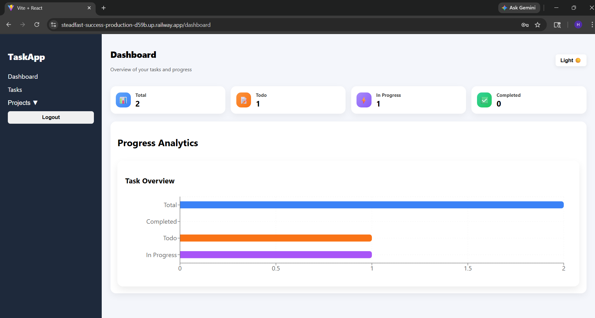
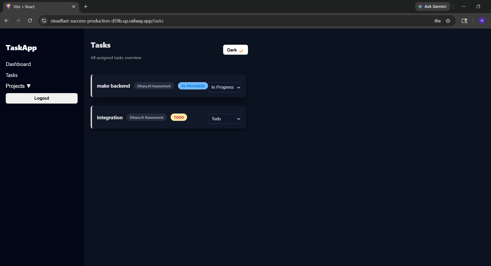
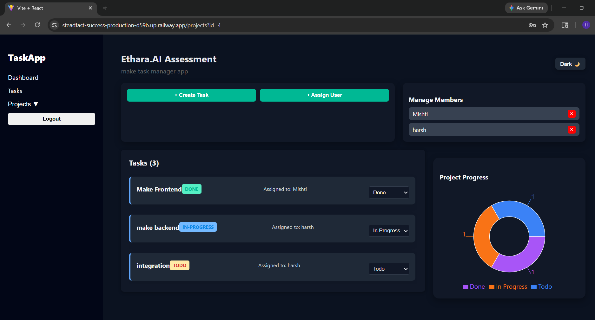

Team Task Manager - Ethara.AI Assessment
=================

Team Task Manager is a full-stack task and project management application built for teams and departments.
It provides user authentication, project creation, member management, task assignments, status updates, and dashboard analytics.

## Project Screenshots

Dashboard Page

Task Page

Project Page


## Project Live Demo

Check out the live project: [Task Manager](https://steadfast-success-production-d59b.up.railway.app)

## 🛠️ Tech Stack Used:

- **React** – UI layer for the frontend
- **Vite** – Fast frontend build tool
- **React Router** – Client-side routing
- **Axios** – HTTP requests to the backend
- **Recharts** – Dashboard charts and graphs
- **Node.js** – Server runtime
- **Express** – API routing and middleware
- **Sequelize** – ORM for SQL database models
- **MySQL / MariaDB** – Relational database backend
- **JWT** – Authentication token handling
- **bcryptjs** – Secure password hashing
- **dotenv** – Environment variables
- **CORS** – Cross-origin API support

## ✨ Key Features

- **User Authentication**: Register, login, and secure API access with JWT.
- **Project Management**: Create projects, assign teams, and manage membership.
- **Task Tracking**: Add and assign tasks, update status, and monitor progress.
- **User Dashboard**: Visual analytics with charts for task distribution and project status.
- **Dashboard statistics**: for project task counts(Bar Chart, Pie Chart)
- **Protected Routes**: Backend endpoints secured by authentication middleware.
- **Modern Frontend**: Fast React app with clean UI and responsive navigation.

## 🚀 Getting Started

### 1. Clone the repository

```bash
git clone https://github.com/your-username/team-task-manager.git
cd team-task-manager
```

### 2. Install backend dependencies

```bash
cd backend
npm install
```

### 3. Configure backend environment

Create a `backend/.env` file with the following values:

```env
PORT=5000
DB_NAME=task_manager
DB_USER=root
DB_PASS=your_db_password
JWT_SECRET=your_jwt_secret
```

### 4. Run the backend

```bash
npm run dev
```

### 5. Install frontend dependencies

```bash
cd ../frontend
npm install
```

### 6. Run the frontend

```bash
npm run dev
```

Open the Vite URL shown in the terminal (usually `http://localhost:5173`).

## 🧩 Project Structure

- `backend/`
  - `app.js` — Express server and API entry point
  - `routes/` — Auth, project, task, and user API routes
  - `controllers/` — Request handlers and business logic
  - `models/` — Sequelize models for User, Project, Task, and Team
  - `middleware/` — JWT authentication middleware

- `frontend/`
  - `src/` — React application source code
  - `src/components/` — UI pages and dashboard components
  - `public/` — Static assets

## 📁 Environment Variables

Backend (`backend/.env`):

- `PORT` — Backend server port
- `DB_NAME` — Database name
- `DB_USER` — Database username
- `DB_PASS` — Database password
- `JWT_SECRET` — Secret for JWT token signing

Frontend (`frontend/.env`):

- `VITE_API_URL` — Backend API base URL (example: `http://localhost:5000`)

## 💡 Usage

- Sign up or log in as a user.
- Create projects and invite or assign team members.
- Add tasks to projects and assign them to users.
- Update task statuses to track progress.
- Review dashboard metrics for task completion and project health.

## 🙌 Contribution

Contributions are welcome. Open an issue or submit a pull request with improvements, bug fixes, or new features.
